# D's Pizza using Django, Python and Postgres.

## Introduction

Welcome to D's pizza - a family run local business, serving the food fanatics for many years. The site proudly presents hand crafted pizzas, perfected with locally sourced ingredients, with our secret tomato sauce on our home made dough.

In addition to yummy (as reviewed!) pizza's, the site offers combo deals which include a pizza, side, drink and a dessert at a value for money price. Whether the customer wants to grab a quick pizza or a family wanted to grab a complete meal, we accomodate for all. 

The intention of the site is to provide the user with a smooth user experience whilst they browse the menu and deals on offer, add items to the cart and place orders via the quick checkout process provided. Regardless of the device used, the performance and usability is maintained through out providing a positive user experience. Potential users of site include regular customers, students wanting best value for money, working proffessionals where time is of the essence or families who want to get the complete meal in a quick and easy way.

## Table of Contents

### User Experience (UX)

* User Stories

* Mind Map: Ideas

* Wireframe Designs 

* UX View

* Pseudo - functions needed (Brainstorm)

* Process Map

* Models and Entity Relationship Diagrams (ERD's)

### Project Walkthrough

### Testing

* Fixed Bugs 

* Validation Testing

* Functionality/performance testing

* Manual Testing

* Automated Testing

* User Story Testing 

### Future Developments

###  Workload Planning

###   Site Production, Deployment and Contribution

 * Site production

 * Deployment

 * Contribution

### Technologies and tools Used

* Languages used

* Frameworks, Libraries and Programs Used
     	
### Credits

* Content

* General
  
* Overall Credit

### Personal Summary

## User Experience (UX)
### User Stories

The first step taken was to the establish the user stories identifying the needs and requirements for the site. These have further provided the foundation for the project allowing me to categorise the development and deployment using agile methodology.

Each user story below has the initial story along with acceptance criteria. These both would need be satisfied during development, testing and deployment for the user story to be considered a success.

### **US1:** As a **Customer** I can **I can add items to the cart** so that **I can review/buy them**
#### Acceptance Criteria
-  Items are available to add to the cart
-  Items with selected quantity are added to the cart
-  A notification is displayed when this occurs
-  The cart displays the quantity total, item total and a grand total for cart
-  Item quantities can be increased from within the cart
-  The cart persists across the site

### **US2:** As a **Customer** I can **remove items from the cart** so that **I can adjust the amount needed**
#### Acceptance Criteria
- The selected item quantity is reduced from the cart
- A notification is displayed when this occurs
- The cart is updated to reflect the change
- The item is completely removed from the cart if the quantity is 0

### **US3:** As a **Customer** I can **proceed to the checkout** so that **I can place the order**
#### Acceptance Criteria
- The checkout provides the customer a summary of the cart
- A form is shown requiring a name, email and phone number which is validated accordingly.
- The option to pay by card is available to the customer

### **US4:** As a **Customer** I can **see order confirmation** so that **I know the order has been placed**
#### Acceptance Criteria
- A confirmation page is displayed with the order number and other relevant information once the payment has been processed successfully 
- The order is saved within the database
- An error page displayed should the payment fail

### **US5:** As a **Customer** I can **save an order as a favourite repeat item** so that **easily re-order in the future**
#### Acceptance Criteria
- An option is given on the confirmation page to add to favourites
- A favourites section is available showing all the favourite items marked as so
- Only the logged in users can see this facility

### **US6:** As a **Customer** I can **access the site on multiple devices** so that **I can view/order when it suits**
#### Acceptance Criteria
- The site is fully responsive across desktop and mobile devices with no loss in performance or functionality
- The UI scales smoothly across devices

### **US7:** As a **Customer** I can **see the complete menu** so that **I can decide If/what I want to order**
#### Acceptance Criteria
- The customer can see the complete menu: Deals, Pizza and Extras
- Any additional product information such as toppings is available to see
- All the information shown is in a clear readable format

### **US8:** As a **Customer** I can **see deals clearly** so that **I can order a complete meal in one go**
#### Acceptance Criteria
- The deals are available in a section of their own 
- Complete descriptions of the items within the deal are available

### **US9:** As a **Customer** I can **see dietary/allergen information clearly** so that **I can make an informed decision when ordering**
#### Acceptance Criteria
- Allergen information is shown on relevant items
- Items can be filtered by dietary needs.

### **US10:** As a **Customer** I can **toggle between light/dark mode** so that **it matches my view preference**
#### Acceptance Criteria
- A simple toggle that allows the change from dark to light and vice versa

### **US11:** As a **admin** I can **add new products** so that **they are available on the menu**
#### Acceptance Criteria
- A form is made available to add the product after validation
- Once saved, the product is shown on the menu real time

### **US12:** As an **Admin** I can **see all the orders** so that **I can aid fulfilment**
#### Acceptance Criteria
- The admin is authenticated as having access to the dashboard
- Orders can be filtered and updated by status i.e. ordered, preparing or ready.

### **US13:** As an **Admin** I can **update products** so that **they always contain the latest information**
#### Acceptance Criteria
- A pre-filled form is made available on the selected product
- Any updates are validated
- The product is updated, notification displayed, and the changes shown dynamically

### **US14:** As an **admin** I can **remove products** so that **they are no longer on the menu**
#### Acceptance Criteria
- A delete option is available
- A confirmation is requested for the delete
- The Item is removed from the DB once confirmed

### **US15:** As a **Admin** I can **see sales statistics** so that **can evaluate best/worst sellers**
#### Acceptance Criteria
- An dashboard available showing real time sale statistics
- Dashboard is filterable on different products/days

Once the user stories had been establised, they were broken down into three milestones within the project:

- MVP Release: Order Flow - the minimum viable product to fulfill the basic requirements.
- User Experience - Enchancing the MVP to give the users a positive user experience on all aspects of the site.
- Product administration - This milestone primarily has the focus of ensuring that any new products, product updates or removals can effectively be carried out allowing the business to run in a streamlined way. 

The user stories above have been placed in the milestones above and have been priortised using the MoSCow priortisation technique allowing the focus on essential features and further making informed decisions on what else could be potentially be included in the final product.

[Back to Contents.](#table-of-contents)

### Mind Maps : Ideas

The proceeding step was to take a simple pen to paper approach to capture a high level view of the functionality required from the site. The purpose of this was to initiate the thought process on how the user stories above could be implemented:

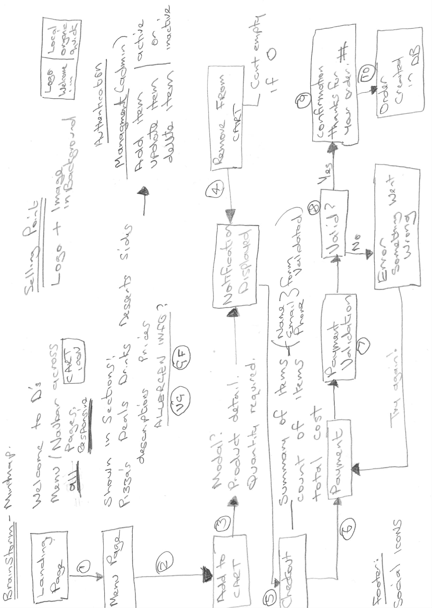

### Wireframe Designs

The next step was to create the wireframes (shown below) using Balsamiq. These wireframes serve the purpose to illustrate the planned layouts and components to help fulfill the user stories.

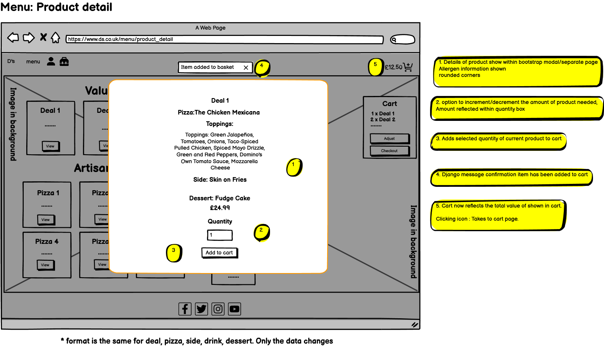

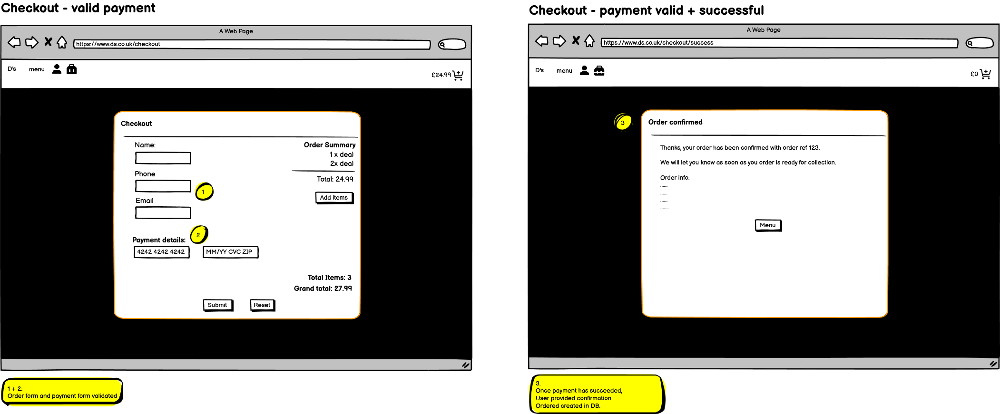

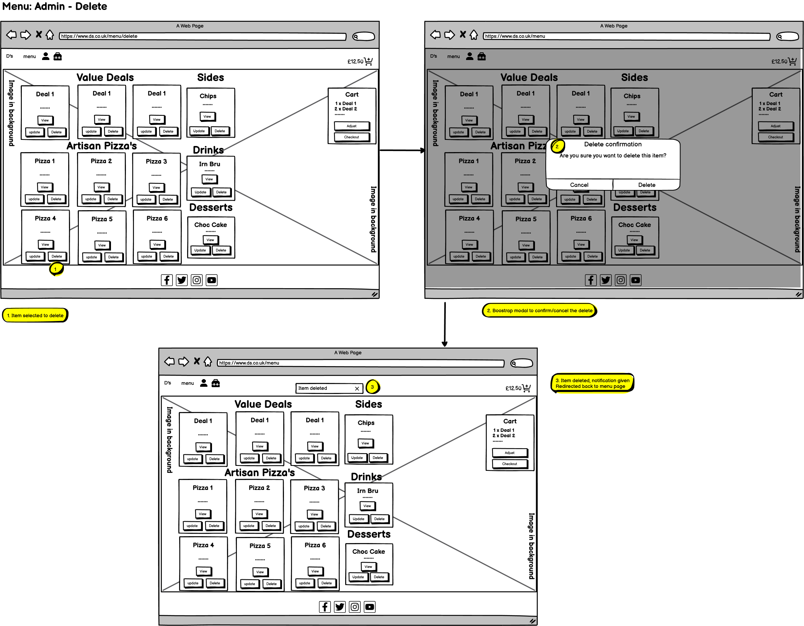

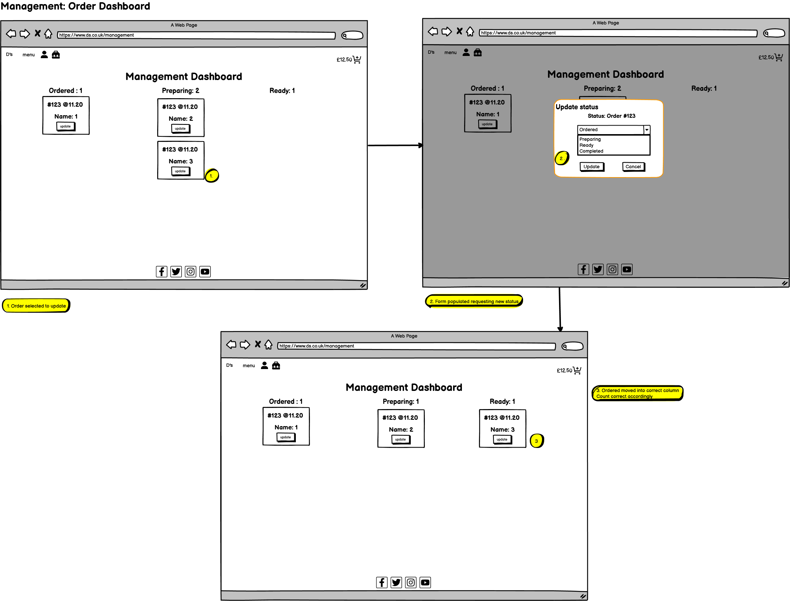

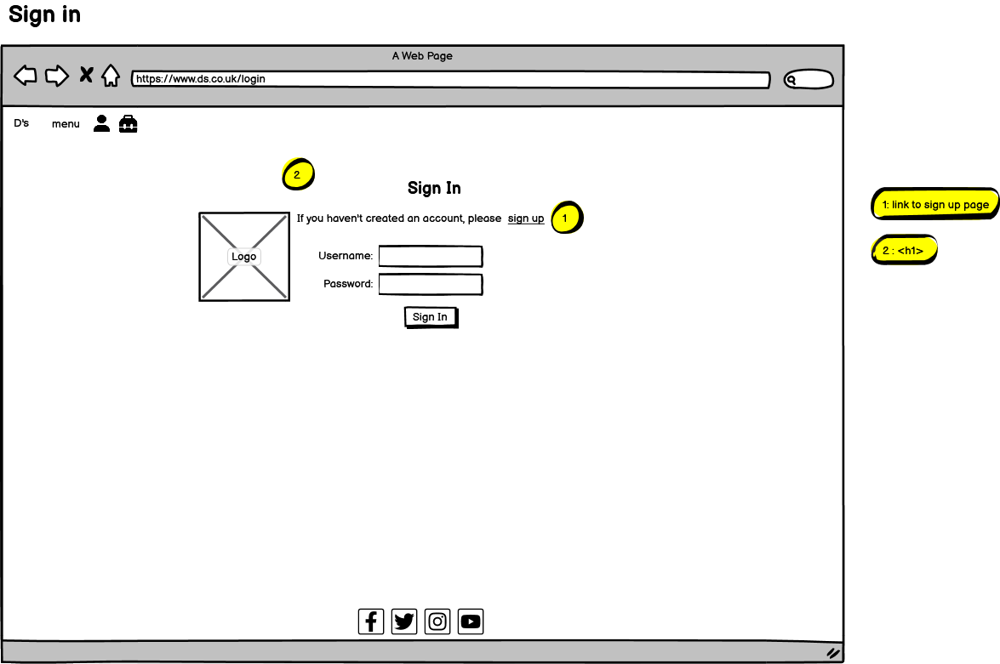

[Back to Contents.](#table-of-contents)

### UX View

Following on from the wireframe designs, final UX views of the site were created:

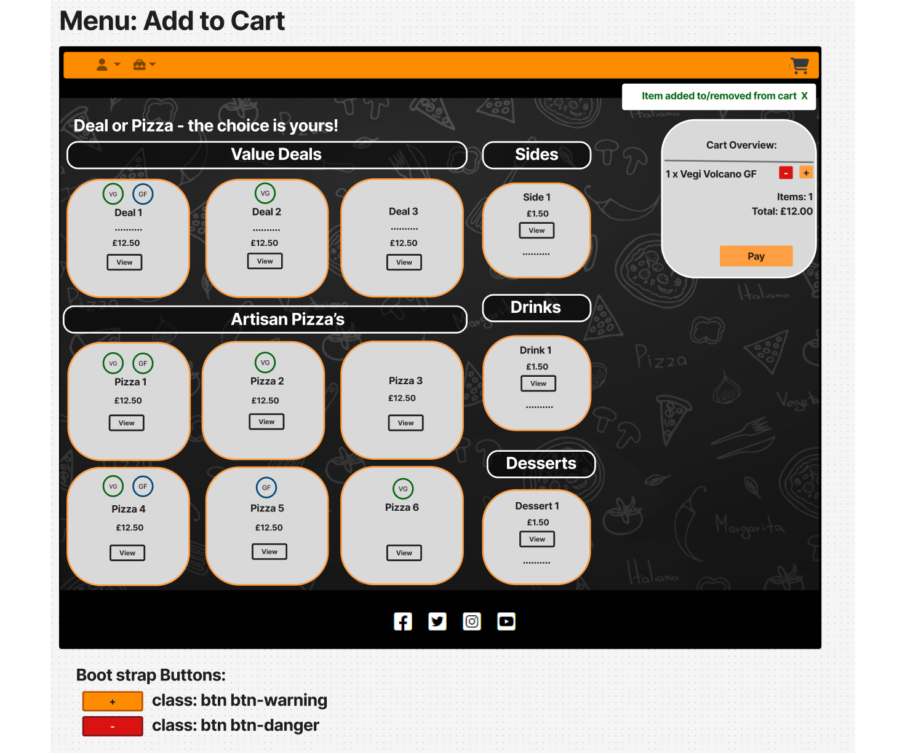

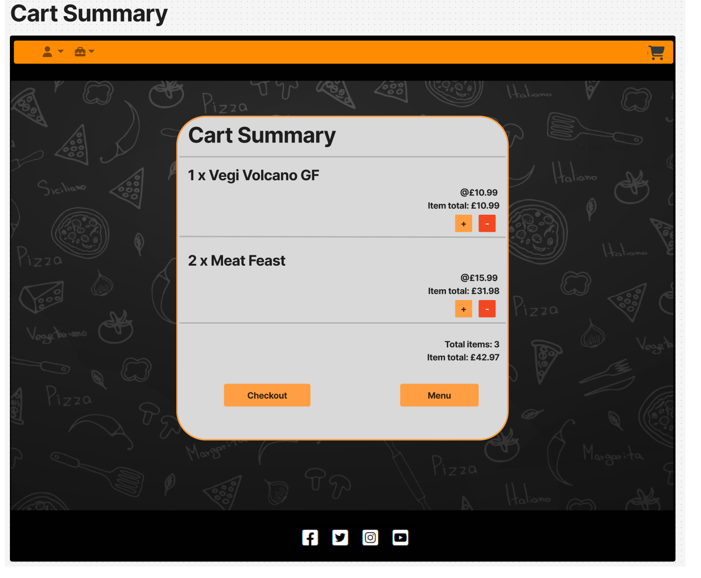

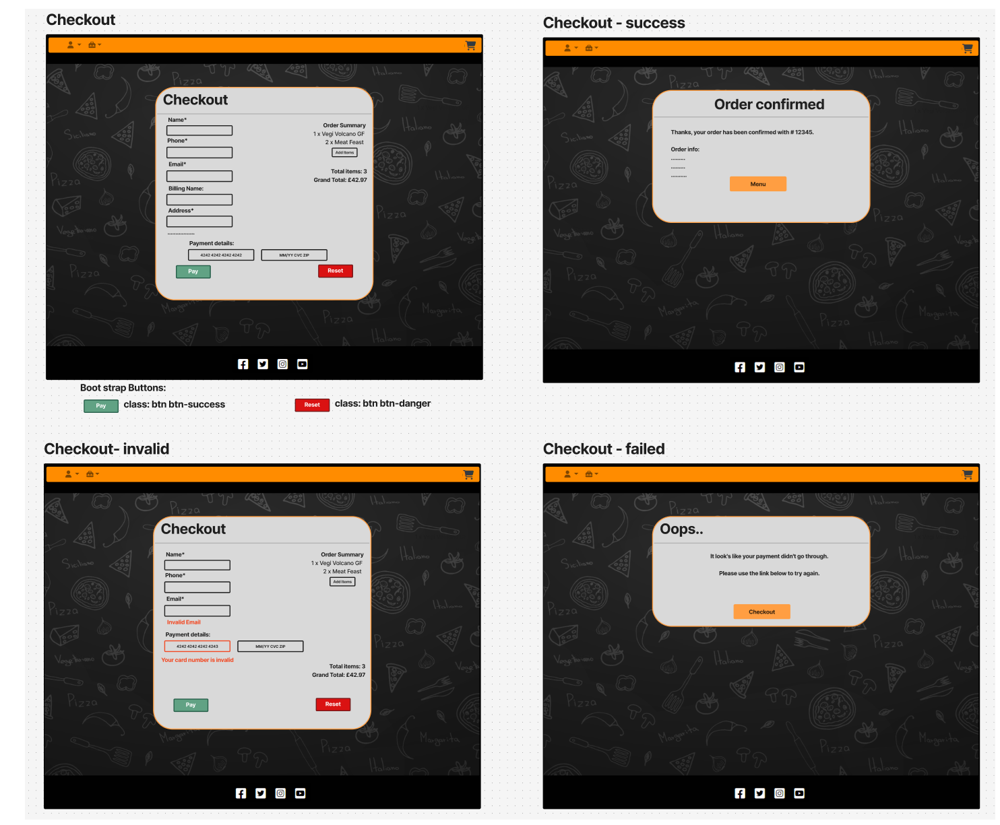

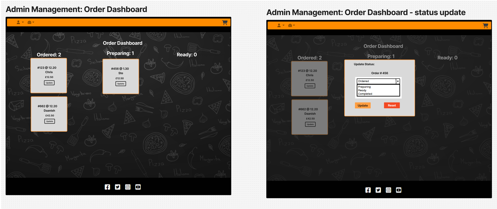

The combination of the wireframes and UX renders of the site have provided a clear picture for the final product. The defintion of colours, classes, placements, and components will act as the reference guide during the course of development to ensure a positive user experience whilst providing the required functionality.

[Back to Contents.](#table-of-contents)

### Pseudo - functions needed (Brainstorm)

The completion of the UX element provided food for thought, and the next step was to brainstorm the potential functions for the customer to order and the admin to maintain the products.

As a customer:

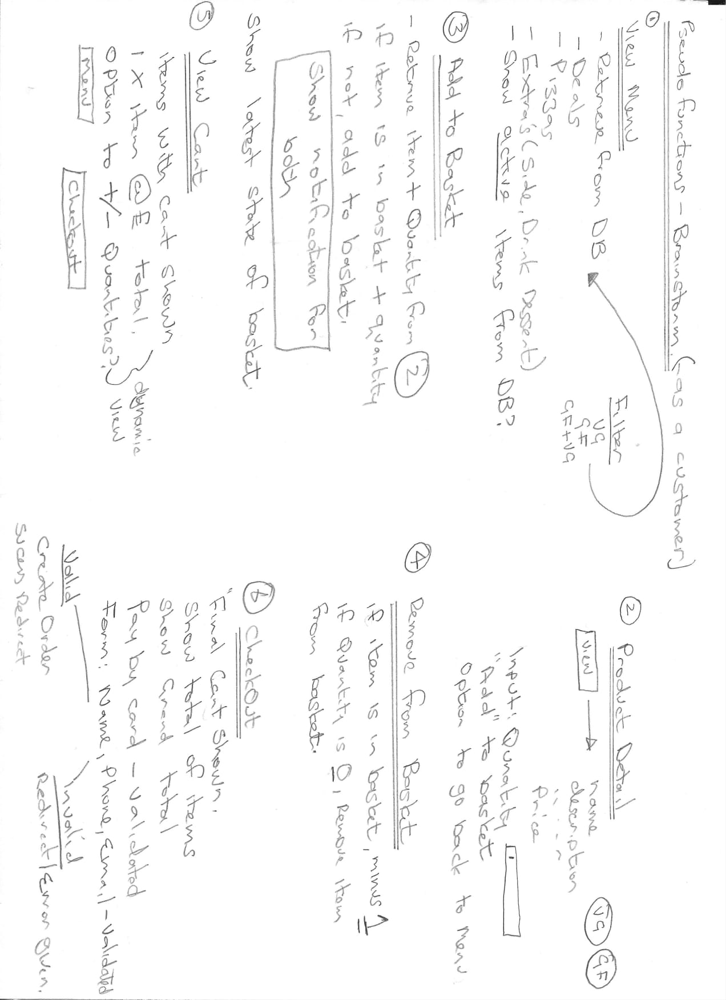

As a admin/superuser:

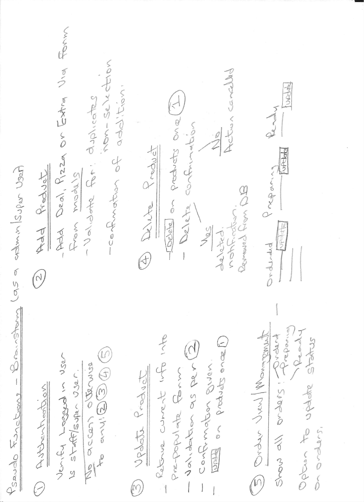

### Process Maps

The diagrams below illustrate the process flow taken by the respected actions and the outcome achieved after any necessary validation:

Add/delete/update an item:

Add item to cart:

Remove from cart:

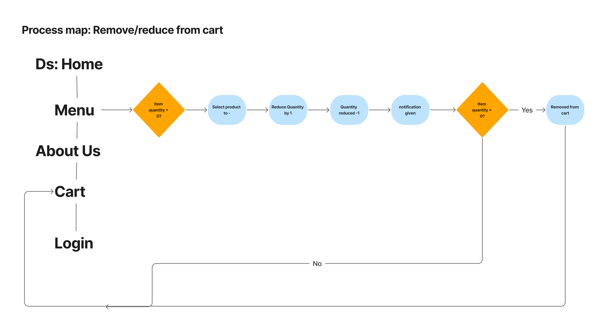

These process maps have played an essential part as a reference guide during the development. They have allowed me to ensure that  requirements and acceptance criteria from the user stories have been satisfied.

### Models and Entity Relationship Diagrams (ERD's)

The project on a whole contains four models:

1. Pizza -  for the Pizza products
2. Deal - for the Deal products
3. Extras - for the extras: sides, drinks and desserts
4. Order - the confirmed order placed (contains line items)
5. OrderLineItem - the items contained within the order(4)

#### 1. Pizza

The Pizza model contains the following setup:

 - name: the name of the pizza
 - description: the toppings on the pizza
 - active: whether the pizza is active or not ( choices: yes/no)
 - is_gf: if the pizza is gluten free
 - is_veg: if the pizza is vegetarian
 - price: the cost of the item

 The ERD schema for the Pizza model is as follows:

 

 #### 2. Deal

 The Deal model contains the following setup:

 - name: the name of the deal
 - pizza: the pizza in the deal from the pizza model*
 - side: the side in the deal from the extra model*
 - drink: the drink in the deal from the extra model*
 - dessert: the dessert in the deal from the extra model*
 - price: the cost of the deal
 - active: whether the deal is active or not (choices: yes/no)

* the associated items need to be active within their models to be a part of this deal. If they were to be deleted/made inactive the logic would assume that the deal would no longer be running.

 The ERD schema for the Deal model is as follows:

  

#### 3. Extras

The Extras model contains the following setup:

- name: the name of the extra
- description: description of the item if applicable
- category: the item is required to sit in a choice: Side, Drink or Dessert
- active: whether the deal is active or not(choices: yes/no)
- price: the cost of the item

 The ERD schema for the Extras model is as follows:

  

 #### 4. PizzaOrder

 The Pizza Order model contains the following setup:

 - order_ref: reference for the order which is generated automatically when the order is created
 - name: the name for the order
 - phone: the phone number associated with the order
 - email: the email associated with the order
 - billing_name: name of the individual making the payment
 - address_line_1: *
 - address_line_2: *
 - town: *
 - postcode: *
 - date: date/time of the order
 - order_total: total of the order
 - status: the status of the order. By default is set to "ordered" when the order is created

 *bill payers address information

#### 5. OrderLineItem

The Order Line Item contains the following setup:

- order: a Foreign key to the Pizza Order model above tying the line items to that specific order
- product: the product on the paticular line
- price: the price per unit of the item
- quantity: the quantity ordered
- line_total: a total of the line items 

The ERD schema for the Pizza Order and OrderLineItem models is as follows:

[Back to Contents.](#table-of-contents)

