# D's Pizza using Django, Python and Postgres.

## Introduction

Welcome to D's pizza - a family run local business, serving the food fanatics for many years. The site proudly presents hand crafted pizzas, perfected with locally sourced ingredients, with our secret tomato sauce on our home-made dough.

In addition to delicious (as reviewed!) pizza's, the site offers combo deals which include a pizza, side, drink, and a dessert at a value for money price. Whether the customer wants to grab a quick pizza, or a family wanted to grab a complete meal, we aim to accommodate for all. 

The intention of the site is to provide the user with a smooth user experience whilst they browse the menu and deals on offer, add items to the cart and place orders via the quick checkout process provided. Regardless of the device used, the performance and usability are maintained throughout providing a positive user experience. Potential users of site include regular customers, students wanting best value for money, working professionals where time is of the essence or families who want to get the complete meal in a quick and easy way.

The live site can be viewed [here.](https://ds-pizza-79dee8bcf8d6.herokuapp.com/)

## Table of Contents

### [Project Planning - precoding](#project-planning---pre-coding)

* User Stories

* Mind Map: Ideas

* Wireframe Designs 

* UX View

* Pseudo - functions needed (Brainstorm)

### [Structure and Processes](#structures-and-processes)

* Process Map

* E-commerce Business Model

* Models and Entity Relationship Diagrams (ERD's)

### [Search Engine Optimisation](#search-engine-optimisation-1)

### [Marketing](#marketing-1)

### [Sitemap](#sitemap-1)

### [Robots](#robots-1)

### [Project Walkthrough](#project-walkthrough-1)
  - ### Introduction
  - ### Home
    - #### Features
  - ### Menu
    - #### Features
  - ### Checkout
  - ### Login and Registration
  - ### Management
  - ### About Us

### [Testing](TESTING.md) 
> [!NOTE]
> For all testing, please refer to the [TESTING.md](TESTING.md) file.

To summarise, the following sections are covered:
 
- Code Validation:
  - HTML
  - CSS
  - JavaScript
  - Python

- Lighthouse scores

- Browser Testing

- Responsiveness and performance Testing

- Defence programming Testing

- Manual Testing

- User Story Testing

- Fixed Bugs

### [Future Developments](#future-developments-1)

###  [Workload: Agile Development Process](#workload-agile-development-process-1)

### [MoSCoW prioritization](#moscow-prioritization-1)

### [Production, Deployment and Contribution](#production-deployment-and-contribution-1)

 * Production

 * Deployment

 * Contribution

 * Lessons Learnt

### [Frameworks, Libraries and Programs Used](#frameworks-libraries-and-programs-used-1)

* Languages used

* Frameworks, Libraries and Programs Used
      
### [Credits](#credits-1)

* Content

* General
  
* Overall Credit

### [Personal Summary](#personal-summary-1)

## Project Planning - pre-coding
### User Stories

The first step taken was to the establish the user stories identifying the needs and requirements for the site. These have further provided the foundation for the project allowing me to categorise the development and deployment using agile methodology.

Each user story below has the initial story along with acceptance criteria. These both would need be satisfied during development, testing and deployment for the user story to be considered a success.

### **US1:** As a **Customer** I can **add items to the cart** so that **I can review/buy them**
#### Acceptance Criteria
-  Items are available to add to the cart.
-  Items with selected quantity are added to the cart.
-  A notification is displayed when this occurs.
-  The cart displays the quantity total, item total and a grand total for cart.
-  Item quantities can be increased from within the cart.
-  The cart persists across the site.

### **US2:** As a **Customer** I can **remove items from the cart** so that **I can adjust the amount needed**
#### Acceptance Criteria
- The selected item quantity is reduced from the cart.
- A notification is displayed when this occurs.
- The cart is updated to reflect the change.
- The item is completely removed from the cart if the quantity is 0.

### **US3:** As a **Customer** I can **proceed to the checkout** so that **I can place the order**
#### Acceptance Criteria
- The checkout provides the customer a summary of the cart.
- A form is shown requiring a name, email, billing information and phone number which is validated accordingly.
- The option to pay by card is available to the customer.

### **US4:** As a **Customer** I can **see order confirmation** so that **I know the order has been placed**
#### Acceptance Criteria
- A confirmation page is displayed with the order number and other relevant information once the payment has been processed successfully. 
- The order is saved within the database.
- An error page displayed should the payment fail.

### **US5:** As a **Customer** I can **save an order as a favourite repeat item** so that **I can easily re-order in the future** - *OPTIONAL*
#### Acceptance Criteria
- An option is given on the confirmation page to add to favourites.
- A favourites section is available showing all the favourite items marked as so.
- Only the logged in users can see this facility.

### **US6:** As a **Customer** I can **access the site on multiple devices** so that **I can view/order when it suits**
#### Acceptance Criteria
- The site is fully responsive across desktop and mobile devices with no loss in performance or functionality.
- The UI scales smoothly across devices.

### **US7:** As a **Customer** I can **see the complete menu** so that **I can decide If/what I want to order**
#### Acceptance Criteria
- The customer can see the complete menu: Deals, Pizza, and Extras.
- Any additional product information such as toppings is available to see.
- All the information shown is in a clear readable format.

### **US8:** As a **Customer** I can **see deals clearly** so that **I can order a complete meal in one go**
#### Acceptance Criteria
- The deals are available in a section of their own.
- Complete descriptions of the items within the deal are available.

### **US9:** As a **Customer** I can **see dietary/allergen information clearly** so that **I can make an informed decision when ordering**
#### Acceptance Criteria
- Allergen information is shown on relevant items.
- Items can be filtered by dietary needs.

### **US10:** As a **Customer** I can **toggle between light/dark mode** so that **it matches my view preference** *-OPTIONAL*
#### Acceptance Criteria
- A simple toggle that allows the change from dark to light and vice versa.

### **US11:** As a **admin** I can **add new products** so that **they are available on the menu**
#### Acceptance Criteria
- A form is made available to add the product after validation.
- Once saved, the product is shown on the menu real time.

### **US12:** As an **Admin** I can **see all the orders** so that **I can aid fulfilment**
#### Acceptance Criteria
- The admin is authenticated as having access to the dashboard.
- Orders can be filtered and updated by status i.e. ordered, preparing or ready.

### **US13:** As an **Admin** I can **update products** so that **they always contain the latest information**
#### Acceptance Criteria
- A pre-filled form is made available on the selected product.
- Any updates are validated.
- The product is updated, notification displayed, and the changes shown dynamically.

### **US14:** As an **admin** I can **remove products** so that **they are no longer on the menu**
#### Acceptance Criteria
- A delete option is available.
- A confirmation is requested for the delete.
- The Item is removed from the DB once confirmed.

### **US15:** As a **Admin** I can **see sales statistics** so that **I can evaluate best/worst sellers** - *OPTIONAL*
#### Acceptance Criteria
- A dashboard available showing real time sale statistics.
- Dashboard is filterable on different products/days.

[Back to Contents.](#table-of-contents)

### Mind Maps : Ideas

The proceeding step was to take a simple pen to paper approach to capture a high-level view of the functionality required from the site. The purpose of this was to initiate the thought process on how the user stories above could be implemented:


### Wireframe Designs

The next step was to create the wireframes (shown below) using Balsamiq. These wireframes serve the purpose to illustrate the planned layouts and components to help fulfil the user stories.


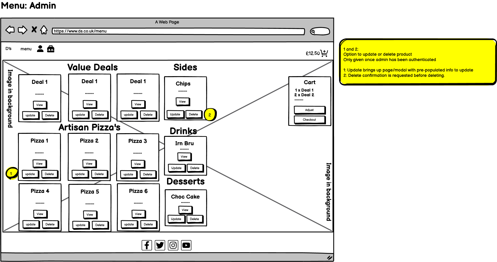

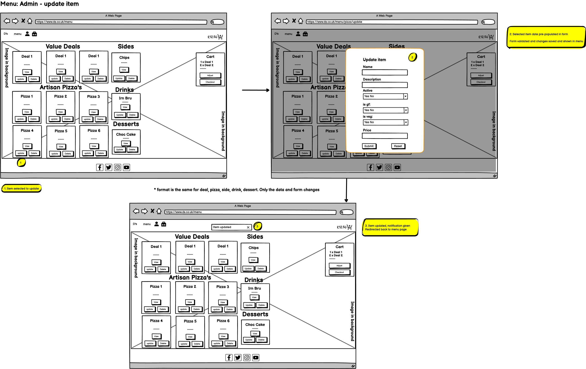


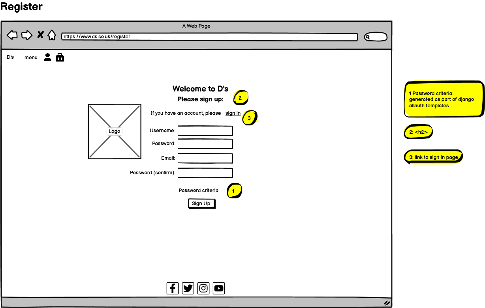


[Back to Contents.](#table-of-contents)

### UX View

Following on from the wireframe designs, final UX views of the site were created:


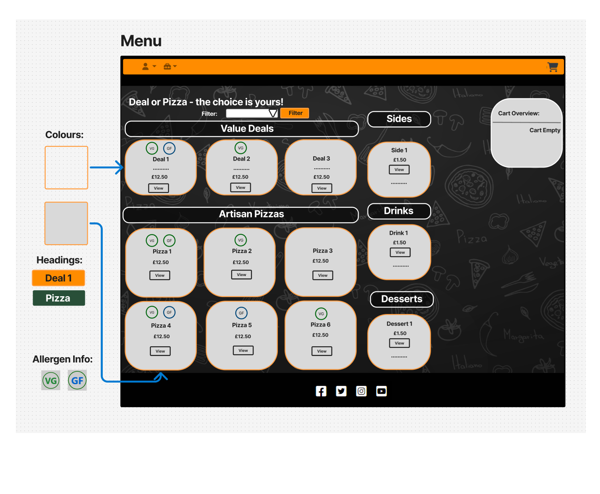

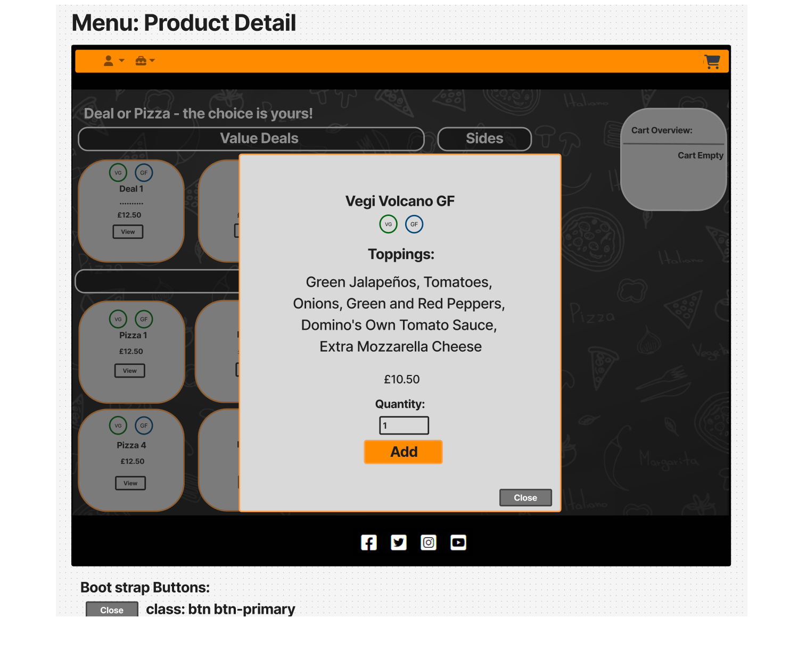


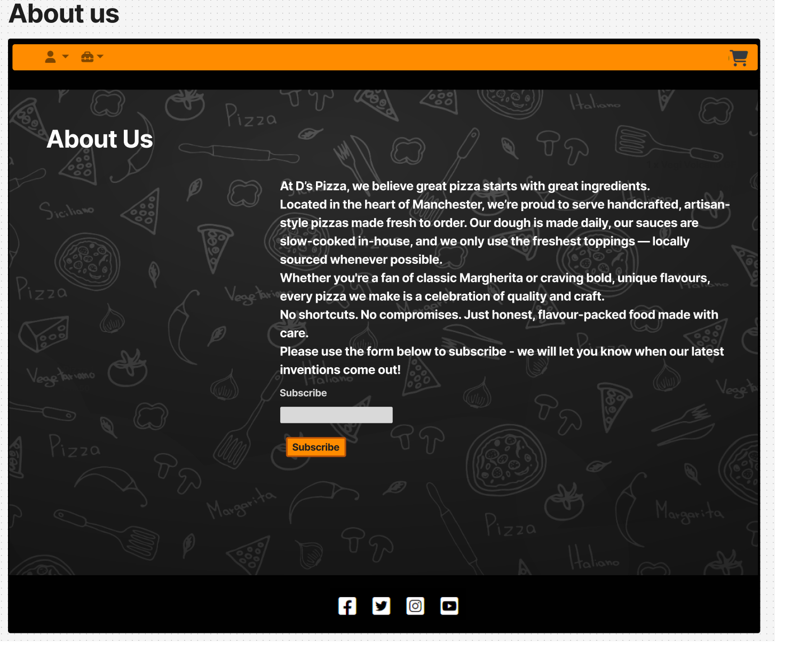


The combination of the wireframes and UX renders of the site have provided a clear picture for the final product. The definition of colours, classes, placements, and components will act as the reference guide during development to ensure a positive user experience whilst providing the required functionality.

[Back to Contents.](#table-of-contents)

### Pseudo - functions needed (Brainstorm)

The completion of the UX element provided something to consider, and the next step was to brainstorm the potential functions for the customer to order and the admin to maintain the products.

As a customer:


As an admin/superuser:


## Structures and Processes

### Process Maps

The diagrams below illustrate the process flow taken by the respected actions and the outcome achieved after any necessary validation:

Add/delete/update an item:


Add item to cart:

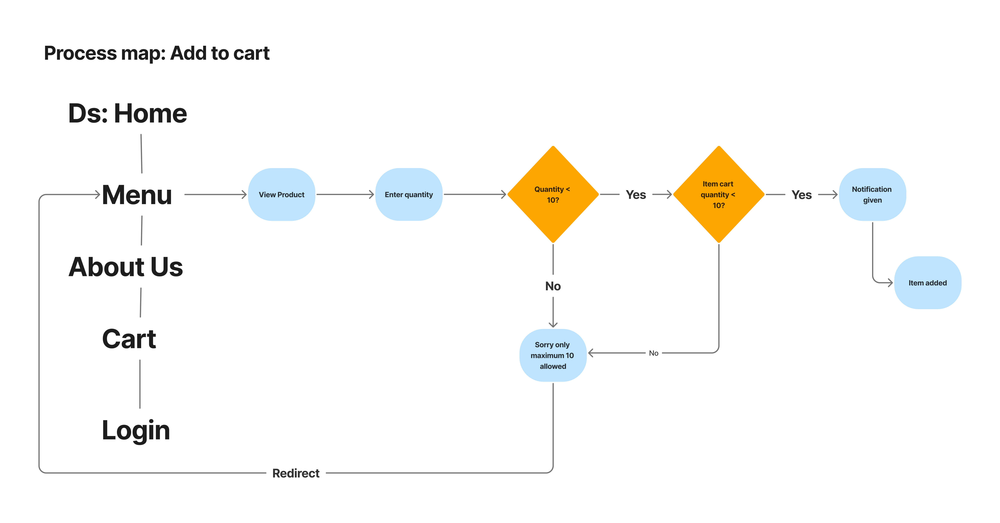

Remove from cart:


These process maps have played an essential part as a reference guide during the development. They have allowed me to ensure that  requirements and acceptance criteria from the user stories have been satisfied.

### E-commerce Business Model

The site requires the user to select a pizza or deal, pay for it, receive confirmation of this order so that the business can proceed to make the food items on the order.

This classifies the site as an e-commerce application as it facilitates business transactions with the transfer of product, user and financial information online resulting in fulfilment of the transaction. The user can freely decide what they want to purchase and how they would like to pay for it without needing any approval or direction.

The e-commerce application falls under the category type of a **Business to Customer (B2C)** with the following criteria:

- A physical product is being sold and provides the following information:
  - Product name – pizza: Mexicana Cheese pizza
  - Clear description – toppings contained on the pizza
  - Any other information: gluten free and/or suitable for vegetarian 
  - Price – cost of the item

- Features:
  - Ability to filter results
  - Cart and payment system
  - Notifications of when item is added to or removed from a basket
  - Notifications of successful order
 
- Payment:
  - single payment taken for the product(s)
  - Confirmation of the order
  - Transaction complete as a “one time service”

### Models and Entity Relationship Diagrams (ERD's)

The project on a whole contains four models:

1. Pizza -  for the Pizza products
2. Deal - for the Deal products
3. Extras - for the extras: sides, drinks, and desserts
4. Order - the confirmed order placed (contains line items)
5. OrderLineItem - the items contained within the order(4)

#### 1. Pizza

The Pizza model contains the following setup:

 - name: the name of the pizza
 - description: the toppings on the pizza
 - active: whether the pizza is active or not ( choices: yes/no)
 - is_gf: if the pizza is gluten free
 - is_veg: if the pizza is vegetarian
 - price: the cost of the item

 The ERD schema for the Pizza model is as follows:

 

 #### 2. Deal

 The Deal model contains the following setup:

 - name: the name of the deal
 - pizza: the pizza in the deal from the pizza model*
 - side: the side in the deal from the extra model*
 - drink: the drink in the deal from the extra model*
 - dessert: the dessert in the deal from the extra model*
 - price: the cost of the deal
 - active: whether the deal is active or not (choices: yes/no)

* The associated items need to be active within their models to be a part of this deal. If they were to be deleted/made inactive the logic would assume that the deal would no longer be running.

 The ERD schema for the Deal model is as follows:

  

#### 3. Extras

The Extras model contains the following setup:

- name: the name of the extra
- description: description of the item if applicable
- category: the item is required to sit in a choice: Side, Drink or Dessert
- active: whether the deal is active or not(choices: yes/no)
- price: the cost of the item

 The ERD schema for the Extras model is as follows:

  

 #### 4. PizzaOrder

 The Pizza Order model contains the following setup:

 - order_ref: reference for the order which is generated automatically when the order is created
 - name: the name for the order
 - user: an optional field which is automatically filled when a logged in user makes the order
 - phone: the phone number associated with the order
 - email: the email associated with the order
 - billing_name: name of the individual making the payment
 - address_line_1: *
 - address_line_2: *
 - town: *
 - postcode: *
 - date: date/time of the order
 - order_total: total of the order
 - status: the status of the order. By default, is set to "ordered" when the order is created

 *Bill payers address information

#### 5. OrderLineItem

The Order Line Item contains the following setup:

- order: a foreign key to the Pizza Order model above tying the line items to that specific order
- product: the product on the line
- price: the price per unit of the item
- quantity: the quantity ordered
- line_total: a total of the line items 

The ERD schema for the Pizza Order and OrderLineItem models is as follows:

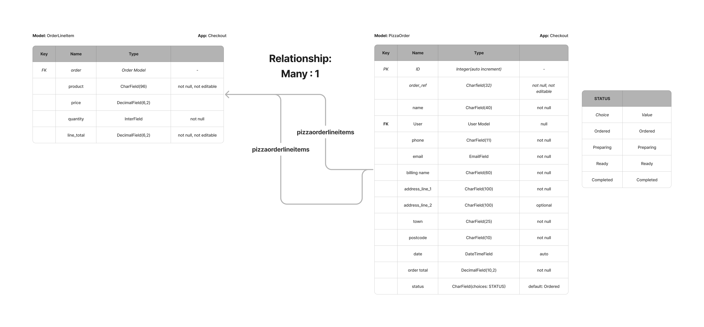

[Back to Contents.](#table-of-contents)

## Search Engine Optimisation

From an e-commerce business perspective, search engine optimisation (SEO) techniques have been utilised to firstly ensure that the site is targeted towards its intended audience and secondly its ranked highly enough in search results.

The initial step taken was to brainstorm potential keywords (both short and longtail) for the pizza business. The thought process behind these keywords has been to simply pace myself in the shoes of customer searching for pizza.

The result of the brainstorm as follows:

| Shortail words          |      Long tail words              |
|:----------------------- |:----------------------------------|
| Pizza                   |Hand crafted Pizzas                |
| Pizza near me           |Pizzas in Manchester               |
| Fresh Pizza             |Pizza Near Me                      |
| Woodfire pizza          |Gluten-Free pizza near me          |
| Order pizza             |Popular pizza deals                |
| Local pizza             |Fresh Artisan Pizza Manchester     |
| Artisan pizza           |Pizza collection open now near me  |
| Fresh pizza             |                                   |
| Pizza Manchester        |                                   |
| Pizza Deals             |                                   |
| Pizza for collection    |                                   |
| Good pizza manchester   |                                   |

Carrying out a quick google search of the words above found that certain words seemed to get lost within the search results such as "order pizza" or "local pizza". This would not be ideal as the site would sit side by side with its potential competitors. 

### SEO Implementation: HTML

To maximise the possibility of the site being returned in the search results, it was decided to use the following key words on the landing page:

```HTML
 <h2>Artisan Pizza</h2>

<h3>Hand crafted pizzas in Manchester</h3>

  <h4> New: Gluten free pizza options</h4>

  <h> semantics tags have been used so they can be picked as a priority over other elements. 
```

### SEO Implementation: Meta data

To further increase reach of the site, the following was adding as meta data:

- `description`: "Ds Pizza in Manchester, providing fresh, local, popular pizzas and deals for collection"

- `keywords`: "love food, artisan pizza, woodfire pizza, local pizza, food deals, pizza deals,
        pizza manchester, pizza near me, pizza for collection, Good pizza manchester"

[Back to Contents.](#table-of-contents)

## Marketing

As D's pizza is a startup business, and to keep costs to a minimum, organic marketing has been opted as the preferred choice to help the brand expand on social media. 

After considering which strategies will work effectively for the e-commerce site, the strategies chosen are:

- Email marketing
- Facebook

These two strategies have been chosen based on the types of users and how the service is available - online. 

The email marketing option allows for the business to send out marketing information such as new deals or voucher codes which the user can use to obtain discounts. To comply with GDPR, this option would allow the user to subscribe to the site with the option to unsubscribe at any time.

The option to use Facebook for core marketing means maximum exposure to a platform where the current users are listed as over 3 billion* The process to quickly create posts, snap and update new product photos means that it can be done quickly and effectively.

*Quick google of the statistics.

### Email marketing

Email marketing has been configured via Mail chimp and is up and running to receive data when a user subscribes via the website about page, and there already appears to be a keen subscriber:


### Facebook

D's pizza is up and running on Facebook pages:


The link to the page can be accessed [here.](https://www.facebook.com/profile.php?id=61577146115956#)


**Please note** The link was active at the same of taking the screenshot above.

[Back to Contents.](#table-of-contents)

## Sitemap

[XML-Sitemaps](https://www.xml-sitemaps.com) has been used to generate a sitemap.xml file, and was generated using my deployed site URL: https://ds-pizza-79dee8bcf8d6.herokuapp.com

The [sitemap.xml](https://github.com/NaveedNaseem84/PP5-Ds_Pizza/blob/main/sitemap.xml) created is included at the root of the repository.

## Robots

A [robots.txt](https://github.com/NaveedNaseem84/PP5-Ds_Pizza/blob/main/robots.txt) has been created and placed within the root-level of the repository. The file itself contains the following settings:
```
User-agent: *
Disallow: /accounts/
Disallow: /admin/
Disallow: /cart/
Disallow: /checkout/
Sitemap: https://ds-pizza-79dee8bcf8d6.herokuapp.com/sitemap.xml 
```

## Project Walkthrough

### Introduction

The site provides the flexibility of allowing the users to place an order in two ways:

 - As an anonymous visitor where there is no registration/login required. A valid payment method is required, where on completion the order is placed.
 - As a registered and logged in user.  In addition to the above, the logged in user can see all their orders in a section within the site which will be demonstrated in this walkthrough.

For the purposes of this project, a *manager* account has been setup with "is staff" permissions so that they can:

- Add any new product to the site.
- Update any current product on the site.
- Delete any product on the site.
- See all the orders made and update their status accordingly.

This *manager* CRUD functionality is carried out fully from the front of the website with *no* need to access the Django admin panel.

## Home

On navigation to the site, the user is presented with a crisp layout, in a vibrant colour scheme. Regardless of device, the site scales across smoothly without affecting performance or UX:

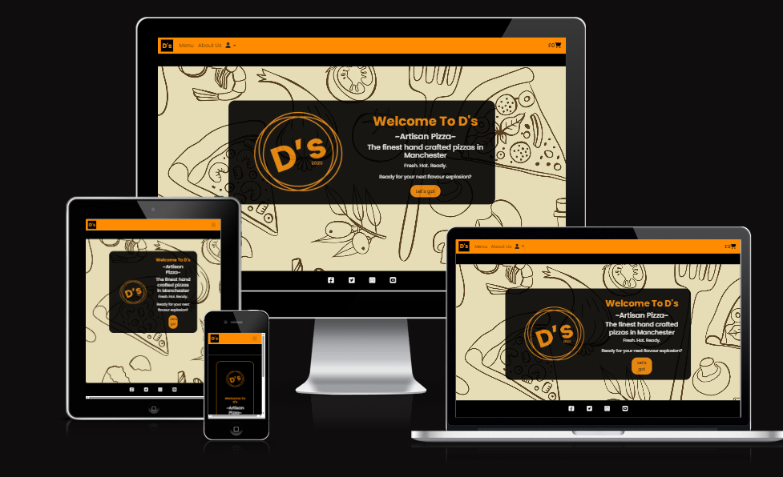

_**Image above generated using https://ui.dev/amiresponsive illustrating the responsiveness of the site.**_

### Features

#### Navigation

The site features a full responsive navigation menu which is made available through the site:


 - The 'Ds' link takes the user back to the home page.
 - The menu and aboutus takes the users to respected pages.
 
Clicking on the 'person' icon next to the about Us link presents a drop-down menu:

 

The drop-down options to login or register take the user to the respected pages which will be covered later in this walkthrough.

The cart icon in the far right navigates the user to cart page - currently empty as there are no items added.

The main focal point of the home page draws the user attention to purpose of the company and site:


The text delivered on the home page implements the keywords chosen as part of the SEO section activity carried out above. Key placement of the words ensures not only to catch the users’ eyes but also aim to return the site amongst search engine searches as a picked option.

#### Footer

Like the nav, bar there is a footer available at the bottom of the screen and is seamlessly available across the site:


- The footer contains links to the respected social media sites Facebook, X, Instagram, and YouTube using font awesome icons.
- These links are all opened in a new tab.

**Please note:** There are currently no active social media pages for D’s. These links have been added in as place holders only.

[Back to Contents.](#table-of-contents)

## Menu

Navigating to the menu page the user is presented with a very flavoursome menu. Displayed in clean, easy to read format, the user can see the deals, pizzas, sides, drinks, and desserts currently on offer in sections. 

Where applicable, any allergen information is clearly displayed within the product information.

 There is also a handy "sticky" cart shown to the right of the screen which dynamically updates when an item is added to the cart:


### Features

#### Allergen filter

A convenient allergen filter is available, which allows the user to filter the products based on the following requirements:

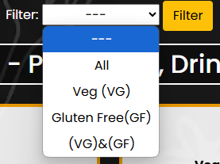

Selecting from one of the options will update the menu, and where applicable the filtered results shown. 

For example, Veg only options:

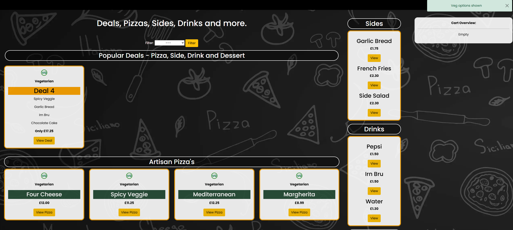

or gluten free options:


Selecting all from the filter removes search criteria and returns the menu back to include all the options. For each selection on the allergen menu, a notification is given in the top right corner:


#### Product information

Each product includes where applicable allergen information, name, description, price, and the option to view for more details:


Selecting "view" on the product, a bootstrap modal popup is presented providing further details of the selected product with the option to add the specified quantity to the cart. For convenience, the minimum quantity has been preset to 1:

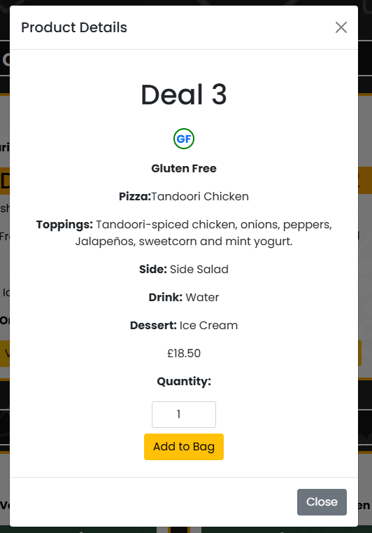

Clicking on the close button will simply close the product information modal bringing the menu back to view.

[Back to Contents.](#table-of-contents)

#### Add to Cart

**Please note** : For the purposes of the project, and to enforce defensive design, the maximum quantity allowed in the cart for an item is 10. In a real-world application the product owner would define this.

Once an item has been selected to add to the cart, the quantity specified and the add button clicked, the item is added to the cart and can be seen in the cart overview on the right. A notification is also given that the item has been added, and the cart total shown on the nav bar:


Once added to the sticky cart, the user has the convenience of increasing/decrease the quantity of the selected item in the cart with a single click.

On increase, the amount is updated and a notification given:

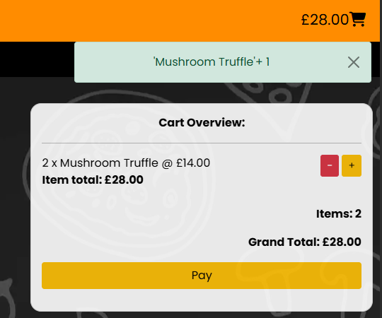

On decrease, again the amount is updated and a notification given:


Should the item quantity already be 10 within the sticky cart, on trying to increase further a notification is displayed:

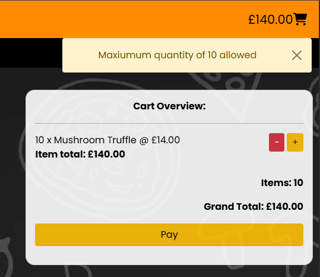

The same applies for when the product is being added/updated via the "view" product option. If the quantity is more than 10 as a new item or the new quantity plus the cart quantity of the item is 10, the notification above is given.

On adding/removing/decreasing products from the sticky cart, the grand total and total items within the bag is updated dynamically to always provide the latest figures.
If all the items have been removed, the sticky cart will show as empty and the grand total in the nav bar as zero:

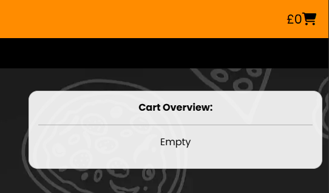

To access the cart in mobile view, simple select three-line toggle located to the top right of the screen and select the cart icon:


Once selected, the cart is displayed. The functionality to increase/decrease items within the cart is done in the same way as sticky cart along with the dynamic update of the item total and grand total. Once the cart is empty, the user is notified and provided a link to handy link to navigate back to the menu page:

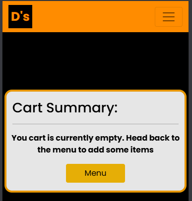

**Please Note**: This mobile cart can also be accessed on a desktop version. The sticky cart has been placed on the same page for ease to improve the user experience and reduce the need to navigate forward and back once items have been added/removed.

[Back to Contents.](#table-of-contents)

#### Checkout

Once the user has finalised the cart, there is the option to navigate to the checkout either by using the "pay" link from the stick cart or the "checkout" link on the cart page presenting the following:


The checkout page provides order summary listing out all the items in the cart at the time of checkout out. In addition to this, there is also the total number of items and a grand total that is the amount to be used at the time of check out.

For convenience, there is also the option to "add items" which would navigate the user back to the menu page.

To successfully checkout the displayed form would need to be filled. The fields present on the form include:

- Name: name for the order - required field
- Phone: validated to have a maximum of 11 numbers only - required field
- Email: correct email syntax - required field
- Billing name: Name of the person paying for the order - required field
- Address line 1: Address of bill payer - required field
- Address line 2: as above, optional
- Town: required field
- Postcode: required field

The final section on checkout page is to include a valid (stripe) card number, expiry, and CVC. Should any of these be invalid, the user is notified accordingly:


If any of the required fields on the main form are incorrect or missing, the user is notified prompting correction:

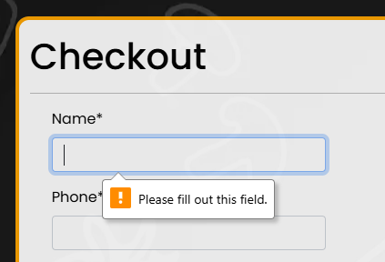

On a valid form and payment submission, the stripe intent is created, updated, succeed and charged. The order is created, and the user can see the confirmation which includes the order summary with an auto generated order number:


Once the order is created, an order confirmation is also sent out to the user via email:

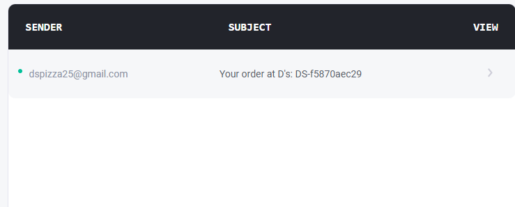

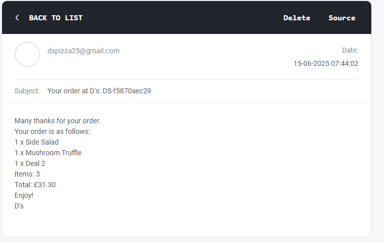

The payment transaction can be verified from the stripe dashboard:


To demonstrate that the order has been created successfully within the database, the admin panel has been inspected and under "Pizza orders" the order just created can be seen in detail:


**Please note**: the login to admin panel is solely to demonstrate that the order has been created successfully with the correct order information from the cart and checkout. There are no tasks required in the admin panel for this functionality to work.

[Back to Contents.](#table-of-contents)

## Login and Registration

### Register: standard user

In addition to placing orders anonymously, the site provides the functionality for users to be able to see all the orders that they have placed.

To access this functionality, the user would need to register and login. This requirement is mandatory so that the orders can be attached to the logged in user only. 

To register, the user would simply click on the person icon on the menu bar and select "register" from the drop down which would navigate to the following page:

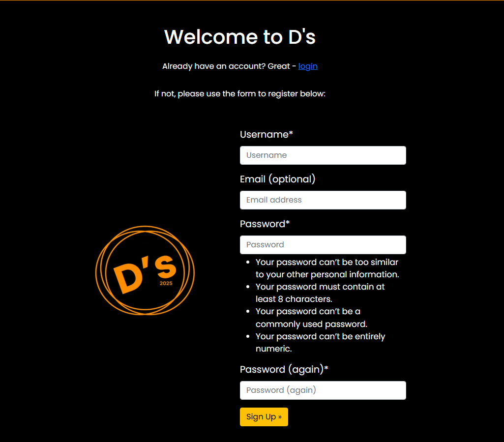

The registration process is simple; a username, optional email address and password created in line with the password guidance provided. Once the account has been created, the user is logged and welcomed:


From here the process to view the menu, see product details, add/remove items to the cart, checkout and pay are identical to that of a non-logged in user which has been covered earlier in this section.

On successful completion of an order, it can now be seen by navigating to the "my orders" section from the menu:


This page provides a count and list of all the orders that the logged in user has created, which are organised to show the latest at the top:


Once the user has completed their activity, they are able to simply log out using the option from the menu. On doing so, the account is now secure, and any order/account information is no longer accessible.

[Back to Contents.](#table-of-contents)

## Management

### Login: manager

As mentioned at the beginning of this project walk through, the *manager* account has been elevated to a "is staff" status allowing  them to manage the site using CRUD completely on the front end.

The log in procedure is the same as a standard user, and once logged in there a few noticeable difference in the options available and the UX:

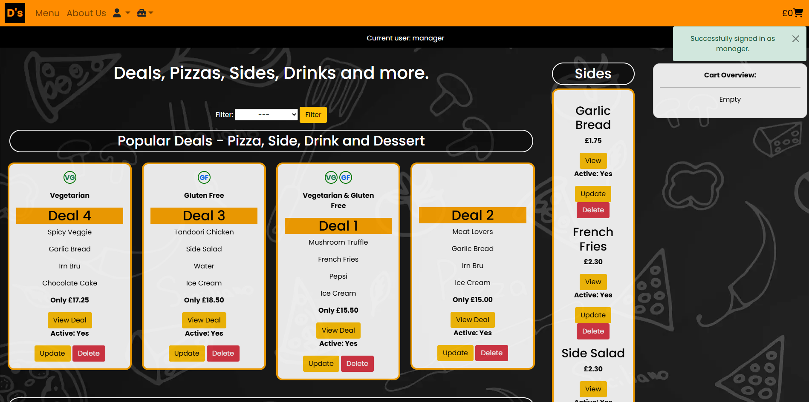

On the menu bar there is additional "toolbox" icon that is now available. The options within include:


The main menu page now includes the options to delete and update a product along with the status of the all the products:


The *manager* has full overview of all the items that exist on the menu. These include items that are active - visible on the live site and items that are in the database but not active.

### Update 

To update an item, "update" is selected which presents a form with all the current information for the item pre-populated:


From this form, any of the details can be updated as required. The mandatory fields are marked up with an Asterix.

On clicking submit, the form is validated and the updates made reflecting instantly on the live menu with a notification given in the top right corner indicating the successful update:


### Delete

The action to delete is carried out in the same manner; by selecting "delete" on the selected product which prompts a confirmation:

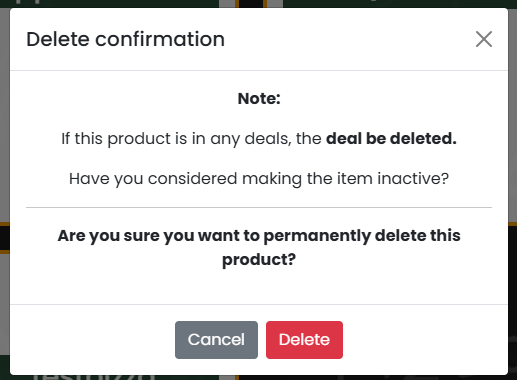

As seen from the confirmation image above, the *manager* is provided with some vital information and given an alternative to permanently deleting.

Should the delete be confirmed, the item is deleted from the menu and database with a notification given:


### Add item

From the "toolbox" icon now available, selecting either the option to either add a new pizza/deal or extra presents a fresh form:


Like the update form, all the mandatory fields are highlighted. The name for each item is required to be unique so that there is no duplication of items across the menu. 

Should the name already be in use on another item, the site informs the *manager* accordingly:

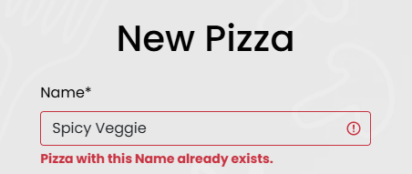

Once rectified, along with the remainder valid form, the item is added onto the menu. Depending on the active state, the item can be seen on the live menu. In line with the rest of the notifications, a message is displayed informing of the successful addition.

### Order Dashboard

A key feature for the *manager* is to be able to see a live dashboard of all the current orders along with their state. This can be seen by navigating to the "Order Dashboard" from the "toolbox" icon:


The page presents the orders in an easy to ready way - especially in a busy kitchen! They are categorised into "ordered", "preparing" and "ready" respectively. Each section heading provides a count of the items within that section.

Updating the order status is quick and easy; simply select the order to update by clicking "update" which prompts the following:


Selecting the relevant status and clicking submit updates the status for that order and the order is placed in the respective section. The count for the section it moved from/to is also updated to reflect the change.

Once an order is ready and been collected, it is recommended to change the status to "Completed" so that it can be taken off the dashboard – it still exists within the database for reporting purposes.

Any users that have created orders whilst logged in, will be able to see the updated status within their orders section allowing for them to plan their trip down to D's.

[Back to Contents.](#table-of-contents)

## About Us

Finally, navigating to the about us page the user can casually read up on the D's business ethos and values promoting how they stand out from their competitors.

Should the user wish to stay up to date on any latest offers or deals, there is the option to subscribe towards the bottom of the page which has been provided courtesy of mail chimp. On subscribing, the user is notified:


## Testing

> [!NOTE]
> For all testing, please refer to the [TESTING.md](TESTING.md) file.

To summarise, the following sections are covered:
 
- Code Validation:
  - HTML
  - CSS
  - JavaScript
  - Python

- Lighthouse scores

- Browser Testing

- Responsiveness and performance Testing

- Defence programming Testing

- Manual Testing

- User Testing

- Fixed Bugs

## Future Developments

There are four potential future developments for this project.

1. Allow the user the option to toggle between light and dark mode on the site so that it matches their viewing preference.

2. Provide the functionality for logged in users to save orders and/or items as favourites so that they can easily re-order in the future.

3. Give management (staff/admin users) the functionality to see sales statistics. This would allow them to see which products are doing well/bad so they can re-align their business strategy accordingly.

4. Allow the users to enter in promotional/discount codes that they have received via social or email marketing.

##  Workload: Agile Development Process

For the purposes of this project, a live GitHub Project was utilised. Through this project, tasks, EPICS, User Stories, issues and bugs, and milestones were documented and tracked on a regular basis through the means of a Kanban board.

The live completed board can be seen [here.](https://github.com/users/NaveedNaseem84/projects/11/views/1)

### GitHub Issues

The use of the [GitHub Issues](https://github.com/naveednaseem84/PP5-Ds_Pizza/issues) agile tool allowed me to manage my user stories. Using this tool has allowed me to easily establish key milestones tasks and track any bugs in the process.

## MoSCoW prioritization

Once the user stories were established, they were broken down and categorised using MoSCoW:

* Must Have: The finished product would have this as a Minimum Viable Product (MVP).
* Should Have: Not vital but provides additional value to project.
* Could Have: Minimum impact if left out.
* Won't Have: Would not be included in this iteration, possibility to be included as part of future developments. 

The project was broken down into three key milestones:

- MVP Release: Order Flow - the minimum viable product to fulfil the basic requirements.
- User Experience - Enhancing the MVP to give the users a positive user experience on all aspects of the site.
- Product administration - This milestone primarily has the focus of ensuring that any new products, product updates or removals can effectively be carried out allowing the business to run in a streamlined way. 

Each user story has been assigned MosCoW labels on the [project board.](https://github.com/users/NaveedNaseem84/projects/11/views/1) The three optional user stories were and have remained in the `Won't Have` category on the backlog as there has been no scope to develop these during this iteration. 

[Back to Contents.](#table-of-contents)

## Production, Deployment and Contribution

### Production

The complete site has been created using VSCode with the following extensions used:

 - Flake8
 - Prettier - Code formatter
 - Python
 - Quokka.js

GitHub has been used for version control throughout the course of the project. The commands carried out to in the command line terminal to commit and push the changes to the GitHub repository:

`git add .` - (Staging the changes in the current working tree ready to be committed).

`git commit -m 'Meaningful commit message"` - (The working tree is prepared with an upload message).

`git push` - (changes are pushed out up to the GitHub repository).

**Please note:** Firstly, ensure that the project `debug` is set to `False` before deploying. Deploying with this switch to `True` on in production can have serious adverse effects!
 
### Deployment

#### Database: PostgreSQL

For the purposes of this project, I have been fortunate enough to have access to databases instances as a Code Institute student. The databases contain a retention period of 18 months with each student allowed a maximum of 8 databases.

I took the following steps to obtain my own PostgreSQL database from Code Institute for this project:

 - Navigating to and entering my Code Institute student email address in the requested [form](https://dbs.ci-dbs.net/).
 - An email was received shortly after containing the URL link to the database.
 - This URL was then added into the `env.py` file within the project and Heroku **config vars** described below.

If you wish to work with a live database, an instance of PostgreSQL would need to be obtained.

#### Heroku

The site is deployed and hosted on [Heroku](https://www.heroku.com/) and the live site can be accessed [here.](https://ds-pizza-79dee8bcf8d6.herokuapp.com/)

To deploy to Heroku, install the following in the project terminal **before deploying**:

 - [requirements.txt](https://github.com/NaveedNaseem84/PP5-Ds_Pizza/blob/main/requirements.txt)
    - This file lists all the packages that are required for the project to run and deploy. This requirements file can simply be installed by using the following in the command terminal: 
    `pip3 install -r requirements.txt`
   - If any additional packages are installed, they would need to be added into the requirements file above and can be done using `pip3 --freeze local > requirements.txt`

- [Procfile](https://github.com/NaveedNaseem84/PP5-Ds_Pizza/blob/main/Procfile)
   - **Please note** the spelling of this file as it needs to be in this format!
   - The file needs to sit in the root of the project repository and can be created by clicking  `file` and clicking `new file`
   - The contents of the file need to be as follows: 
   `web: gunicorn appname.wsgi`
   - Replace `appname` to the name of your Django project exactly. This is located on the same level as your `settings.py` file.

- In the `settings.py` file, append the `.herokuapp.com'` hostname to the ALLOWED_HOSTS list.

**Please note**: For the purposes of this project, the Procfile is already in place. The `appname` would need to be adjusted as needed.

Once logged into the Heroku site, click the toggle menu in the top right corner and click **Dashboard** and then **New** and **New app** on the option that drops down:


- Create a suitable name for your app and select the region that applies and select **Create App**. It may take a few minutes for the new app to appear.

- On the tab at the top, select **Settings** and scroll down to **Reveal Config Vars**. 

For the purposes of this project, the following keys have been used:

| Key                   | Value                    |
| ----------------------| -------------------------|
`DATABASE_URL`          |insert-postgres-db-url    |
`EMAIL_HOST_PASSWORD`   |insert-gmail-app-API-key  |
`EMAIL_HOST_USER`       |insert-gmail-email-address|
`SECRET_KEY`            |random-secret-key         |
`STRIPE_PUBLIC_KEY`     |insert-stripe-public-key  |
`STRIPE_SECRET_KEY`     | insert-stripe-secret-key |
`STRIPE_WH_SECRET`      | insert-stripe-webhook-key|

**Please note** If there are any additional API's that you wish to include such AWS, the keys would need to be added in the same manner to the `config vars` and into the `env.py` file below.

The next step is to connect your GitHub repository to Heroku. To do this:

- Go to the **Deploy** tab at the top.
- Select **GitHub** as the Deployment method.
- Select **Connect to GitHub.**
- Search for your GitHub repository and click connect. Once connected, it will show as follows:


- Scroll down to **Manual deploy** and click **Deploy branch**. The app will start to build installing the various packages listed and the dependencies from the requirements.txt file. Once complete, click on the **view** button which will take you to the live site.

There is also the option to **Enable Automatic Deploys** which will build the app as soon as it is pushed to the GitHub repository and can be used if preferred.

#### Localised Development

The project would need to be cloned/forked locally so that it can be worked. For clone or Fork, the packages listed within the `requirements.txt` need to be installed and can be done so by doing:
 `pip3 install -r requirements.txt`

To clone:

You can clone the repository by following these steps:

1. Go to the [GitHub repository](https://www.github.com/naveednaseem84/PP5-Ds_Pizza).
2. Locate and click on the green "Code" button at the very top, above the commits and files.
3. Select whether you prefer to clone using "HTTPS", "SSH", or "GitHub CLI", and click the "copy" button to copy the URL to your clipboard.
4. Open "Git Bash" or "Terminal".
5. Change the current working directory to the location where you want the cloned directory.
6. In your IDE Terminal, type the following command to clone the repository:
  - `git clone https://www.github.com/naveednaseem84/PP5-Ds_Pizza.git`
7. Press "Enter" to create your local clone.

To Fork:

By forking the GitHub Repository, you make a copy of the original repository on our GitHub account to view and/or make changes without affecting the original owner's repository. You can fork this repository by using the following steps:

1. Log in to GitHub and locate the [GitHub Repository](https://www.github.com/naveednaseem84/PP5-Ds_Pizza).
2. At the top of the Repository, just below the "Settings" button on the menu, locate and click the "Fork" Button.
3. Once clicked, you should now have a copy of the original repository in your own GitHub account!

The official GitHub documentation on how to do this is also available [here](https://docs.github.com/en/get-started/exploring-projects-on-github/contributing-to-a-project#forking-a-repository).

Once the repository has been cloned or forked, a local `env.py` file needs to be created in the root of the project. Once created, the environmental variables added to the Heroku **config vars** need to be added using the same spellings and values. For example, the `env.py` file will have the following structure:

```import os

os.environ.setdefault(
    "DATABASE_URL",
    "URL-to-DB)

os.environ.setdefault("SECRET_KEY", "value")

os.environ.setdefault('STRIPE_PUBLIC_KEY', 'value')

os.environ.setdefault('STRIPE_SECRET_KEY', 'value')

....
....

```
**Please note** The `env.py` above is just an example and not actual file.

Once this has been created, the project can be started up using `python3 manage.py runserver`. Press `CTRL + C` before the next step to stop the server.

To setup the database locally, the following command would need to be ran:

 - `python3 manage.py makemigrations --dry-run` 
 - `python3 manage.py makemigrations`

 then:

 - `python3 manage.py migrate --plan`
 - `python3 manage.py migrate`

Once the migration is complete, a superuser needs to be created and can be done using:

- `python3 manage.py createsuperuser`

**please note** This superuser is required to access the admin panel.

Once everything has installed and migrated successfully, the app can now be ran using `python3 manage.py runserver`. Please watch out for instructions in the terminal as it will inform you on how to open the webpage.

#### Static Files

The files located within the root static folder are collected and deployed to Heroku using a package called `White Noise`. This is already included as part of the `requirements.txt` file. However, if there are changes to any of the files (images, JavaScript, CSS etc) these changes would need to be "collected" before deployment. This can be done using:

`python manage.py collectstatic`

Once collected, the deployed can be carried out after pushing to GitHub and deploying using the steps above.

#### Stripe API

This project uses [Stripe](https://stripe.com/gb) to process the payments. Once you have created an account and logged in, there will be two keys that are required made available on the dashboard:

-  `STRIPE_PUBLIC_KEY` = Publishable Key (starts with **pk**)
- `STRIPE_SECRET_KEY` = Secret Key (starts with **sk**)

These two keys would need to be added to the `env.py` and Heroku **config Vars** as the earlier keys.

To link up your deployed site so that "webhooks" notifications can be received (used to determine if the payment succeeded or not), on the Stripe Daskboard:
- Click **Developers** then **Webhooks**
 - Add **endpoint** entering the deployed Heroku link to the site.
 - Click **receive all events**
 - Click **add end point**
 - Stripe will provide a `STRIPE_WH_SECRET` which will need to be added in to the Heroku **config vars** and the `env.py` respectively. 

#### Google mail API

The site order confirmation is sent using the Google [Gmail](https://www.gmail.com) product. This can be setup using an existing email address or a new one. 

Once logged in:

1. Log into your Gmail account. Then click the cog icon to open **Settings** and select **See all settings**.
2. Click **Accounts and Import** from the top nav.
3. Click **Other Google account settings**.
4. Click the **Security** tab on the left.
5. Select **2 step verification** - you may be asked to enter your email and/or password to confirm.
6. After verification, ensure to turn this on
7. Click on the back arrow to return to the previous menu
8. In the search bar at the top, search for **app password** and select the suggested option.
9. Enter a name for your app and click **create**.
10. Make a note of the password given: **this is only shown once so keep it safe!**
11. Add the following keys to the `env.py` and the Heroku **config vars**
  - `EMAIL_HOST_PASSWORD` = the app password above (without any spaces/dashes)
  - `EMAIL_HOST_USER` = the email address being used

Step by step instructions with images are available and can been viewed [here.](https://codeinstitute.s3.eu-west-1.amazonaws.com/PDF/Configuring+Gmail+for+e-commerce+emails.pdf)

[Back to Contents.](#table-of-contents)

### Contribution

I welcome any contributions, recommendations, or changes to the project. To do this, the GitHub repository would need to be forked or cloned from GitHub and downloaded locally so it can be worked on. Instructions on how to do this have been provided in the previous section.

#### Lessons Learnt

During the development of project, I discovered that I had (as a complete oversight!) accidently pushed the local database and associated files to the GitHub repository. Although the impact of this on this project was low, I understand the severity of this in a real-life scenario and took the necessary measures to correct this and re-secure the project after seeking advice from my mentor on how to best correct. This included:
 - Using the command `git rm -r--cached` to remove the affected files from the repository.
 - re-listing them correctly within the `.gitignore` file - checking again they were in there correctly!
 - Changing the associated credentials: `secret key` within the `env.py` and Heroku **config vars.**
 - Changing the superuser password for the databases.
 - Re-pushing back up to GitHub and double checking that the files were no longer being pushed as part of the commit. 
 

I believe I have taken all the necessary steps to ensure that there are no points left uncovered and have taking this on as a critical learning curve to ensure it does not happen on any future projects.

## Frameworks, Libraries and Programs Used

### Languages used
 - HTML
 - CSS
 - JavaScript
 - Python 


 ### Framework
  * #### [Django framework](https://www.djangoproject.com/)

* #### The following libraries were used:

  * Crispy forms: To allow the control and rendering of all the forms.    
  * Allauth: To allow registration, login, authentication, and logout of users. 
  * Whitenoise: To allow the project to serve its own static files.

**Please note** A full list of the requirements is available in the `requirements.txt` file.
    
* #### Google Fonts: [Poppins](https://fonts.google.com/specimen/Poppins)
  * Poppins has been used as the default font for the site.

* #### Font Awesome: [Font awesome](https://fontawesome.com/)

  * The social media icons on the footer were placed used font awesome. The classes used are listed in the UX section.

* #### VSCode:

  * Full version of VSCode using git to push to GitHub using version control.

* #### GitHub:

  * GitHub has been used to store the version control repository for the project.

* #### Heroku:
  * Heroku has been used to build and deploy the project.

* #### Figma: [Figma: The Collaborative Interface Design Tool](https://figma.com/)

  * Figma has been used to create the logo, process maps, UX illustrations of the site, and ERD's diagrams for the models.

* #### Balsamiq: [Balsamiq: Wireframe your way to faster, better product decisions ](https://balsamiq.com/)

  * Balsamiq has been used to create the wireframes.

* #### favicon.io: [favicon.io](https://favicon.io/favicon-converter/)
  * Used to create the favicons from an image (Image credited below).

* #### [TinyPNG – Compress WebP, PNG and JPEG images intelligently.](https://tinypng.com/)
  * Tiny PNG was used to optimise the images for web use. 

[Back to Contents.](#table-of-contents)    


## Credits

* The background image used on the home/index page was taken from [Adobe Stock -Pizza seamless pattern ](https://stock.adobe.com/uk/Library/urn:aaid:sc:EU:85254f1c-455a-4167-b43b-0e2a645b5c48?asset_id=319104183)

* The background image used on remaining pages was taken from [Adobe Stock -Pizza food menu for restaurant and cafe. Design banner with hand-drawn graphic elements in doodle style. ](https://stock.adobe.com/uk/Library/urn:aaid:sc:EU:85254f1c-455a-4167-b43b-0e2a645b5c48?asset_id=198506301)

* The image used on the About us page was taken from [Adobe Stock - Making a pizza spreding tomato sauce on the dough on the grey concrete background](https://stock.adobe.com/uk/Library/urn:aaid:sc:EU:85254f1c-455a-4167-b43b-0e2a645b5c48?asset_id=421437256)

* The image used to create the favicon was taken from: [FlatIcon.](https://www.flaticon.com/free-icon/pizza_706918?term=pizza&page=1&position=21&origin=search&related_id=706918)

* The logo animation was applied using the tutorial from [CSS Tricks - A Handy Little System for Animated Entrances in CSS](https://css-tricks.com/a-handy-little-system-for-animated-entrances-in-css/)


### Content

* The production of this `README.md` and the `TESTING.md` has been done with the guidance given in [Markdown Builder](https://markdown.2bn.dev/)
   - This markdown has provided the core steps detailed within the deployment section above such as the setting up of the gmail API, Stripe API, forking/cloning from GitHub and deployment to Heroku and as a general reference guide.  

* The general setup and structure for the project was completed following the guidance provided in the [Project - Boutique Ado CI Project](https://learn.codeinstitute.net/courses/course-v1:CodeInstitute+EA101+7/courseware/eb05f06e62c64ac89823cc956fcd8191/3adff2bf4a78469db72c5330b1afa836/)
  * This includes:
    * Adding items to/from the cart
    * Adding, deleting and updating items on the menu
    * Viewing item details
    * Checkout and order confirmation process

* The core structure for the `base.html` template was taken from the [Boutique Ado CI Project](https://learn.codeinstitute.net/courses/course-v1:CodeInstitute+EA101+7/courseware/eb05f06e62c64ac89823cc956fcd8191/fd5e6b796c0045358567707d02060317/) and customised inline with this project.
  - This includes the URL imports included in the [core.html.](https://github.com/NaveedNaseem84/PP5-Ds_Pizza/blob/main/templates/includes/coreurls.html) 
  

* The core boostrap responsive navbar in the `base.html` was implemented using the [Boostrap - Navbar](https://getbootstrap.com/docs/5.0/components/navbar/) documentation and adapted to fit inline with this project.

* The core boostrap [delete modal](https://github.com/NaveedNaseem84/PP5-Ds_Pizza/blob/main/menu/templates/includes/delete-modal.html) and [product details](https://github.com/NaveedNaseem84/PP5-Ds_Pizza/blob/main/menu/templates/includes/product-detail-modal.html) was implemented using the [Boostrap - Modal](https://getbootstrap.com/docs/5.0/components/modal/) and customised as needed.
   - The code to display this within `menu.html` was adapted from [Project- Boutique Ado CI Project](https://learn.codeinstitute.net/courses/course-v1:CodeInstitute+EA101+7/courseware/eb05f06e62c64ac89823cc956fcd8191/9b257df92c9e4149bf90203b6c5ae1af/). The code utilised is:

   ```
   <script>
        //utilised from CI ado project -credit in readme.md
        $(document).ready(function () {
            if (document.getElementById('productDetail')) {
                $('#productDetail').modal('show');
            }
        });
    </script>
    ```
 - The logic to delete items and increase/decrease cart quantities (JavaScript) was taken from [I Think Before I Blog > Views Part 3 > Editing and deleting records - CI Project](https://learn.codeinstitute.net/courses/course-v1:CodeInstitute+FSD101_WTS+6/courseware/713441aba05441dfb3a7cf04f3268b3f/21a16093c0084895a6073422447c3f7d/?child=first) and adapted further for this project.
    * This is present within [management.js](https://github.com/NaveedNaseem84/PP5-Ds_Pizza/blob/main/static/js/management/management.js) and [cart.js](https://github.com/NaveedNaseem84/PP5-Ds_Pizza/blob/main/static/js/cart/cart.js)

* Implementation and setup (including adding links to the nav-bar and authentication messages displayed in the `base.html` template) of the Django Allauth authentication was done using [I think before I Blog > Authentication > Introduction to authentication - CI Project.](https://learn.codeinstitute.net/courses/course-v1:CodeInstitute+FSD101_WTS+6/courseware/713441aba05441dfb3a7cf04f3268b3f/f614040ed41a49dbb268f0102af9ce05/)
  * The standard register, login, logout allauth templates were customised to match the needs of the project.

* The Django messages in the `base.html` template were displayed by adapting the code from  [I Think Therefore I Blog > Views Part 3>POSTing and writing to the database - CI Project.](https://learn.codeinstitute.net/courses/course-v1:CodeInstitute+FSD101_WTS+6/courseware/713441aba05441dfb3a7cf04f3268b3f/21a16093c0084895a6073422447c3f7d/?child=first)

  * The code utilised:
  ```
  ....
  
      <div class="alert {{ message.tags }} alert-dismissible
        fade show" id="msg" role="alert">
        {{ message | safe }}
        <button type="button" class="btn-close"
          data-bs-dismiss="alert" aria-label="Close"></button>
      </div>
      
  ....
  ```
  * This was further refined in line with the project.

* The logic to add in the items to the cart was adapted from the [Project- Boutique Ado CI Project > Adding Products > Adding Products Part 1](https://learn.codeinstitute.net/courses/course-v1:CodeInstitute+EA101+7/courseware/eb05f06e62c64ac89823cc956fcd8191/f324de58c90e47bd9497bf5839cf1859/)
  - The code utilised:
  ```<div class="form-row">
                  <div class=" container col-sm-3 col-md-3">
                      <p class="mt-3"><strong>Quantity:</strong></p>
                      <div class="form-group">
                          <div class="input-group">
                              <input class="form-control qty_input" type="number" name="quantity" value="1" min="1"
                                  max="99" data-item_id="{{ selected_product.id }}" id="id_qty_{{ selected_product.id }}">
                          </div>
                      </div>
                  </div>
                  <div class="col-12">
                      <input type="submit" class="btn btn-warning" value="Add to Bag">
                  </div>
                  <input type="hidden" name="item_id" value="{{ selected_product.id }}">
                  <input type="hidden" name="item_type" value="{{ item }}">
              </div>
  ```
  * This was further refined in line with the project.

* The database exception using try catch implemented in `menu_view` [see file](https://github.com/NaveedNaseem84/PP5-Ds_Pizza/blob/main/menu/views.py) located in the `menu` app was done so by following the guidance given on [Stack OVerflow -How to handle database exceptions in Django?](https://stackoverflow.com/questions/14195544/how-to-handle-database-exceptions-in-django)

* The concept of passing in the item type with the URL on selection was adapted from [Stack Overflow -How to add url parameters to Django template url tag?](https://stackoverflow.com/questions/25345392/how-to-add-url-parameters-to-django-template-url-tag)

* The [`contexts.py`](https://github.com/NaveedNaseem84/PP5-Ds_Pizza/blob/main/cart/contexts.py) located in the `cart` app was setup using the core foundations provided by [Project- Boutique Ado CI Project > The Shopping Bag  The Shopping Bag.](https://learn.codeinstitute.net/courses/course-v1:CodeInstitute+EA101+7/courseware/eb05f06e62c64ac89823cc956fcd8191/9c06563251a34ed19f5d4273ab4d55ab/)
  - This was further streamlined to incorporate items being adding in from multiple models.

* The automatic creation of the Order number using UUID in the [checkout_view](https://github.com/NaveedNaseem84/PP5-Ds_Pizza/blob/main/checkout/views.py) in the `checkout` app was implemented using the tutorial [Geeks for geeks: Using the uuid Module](https://www.geeksforgeeks.org/python/python-generate-random-string-of-given-length/)
  - This was customised so that the order number generated was the required length and format.
  - The core checkout view itself was created using [Project - Boutique Ado > The Checkout App > Views and Templates.](https://learn.codeinstitute.net/courses/course-v1:CodeInstitute+EA101+7/courseware/eb05f06e62c64ac89823cc956fcd8191/4e0f96c858d643f3bdc1b017180bea1f/) as a reference guide and adapted to my project needs.

* The use of stripe has been setup using the videos provided in the [Project - Botique Ado CI Project > Setting Up Payments  Customising Payment Forms and Setting Up Stripe Integration](https://learn.codeinstitute.net/courses/course-v1:CodeInstitute+EA101+7/courseware/eb05f06e62c64ac89823cc956fcd8191/97568b525c8b4387924451f8c7353ef6/)
  - The code content of the `stripe_elements.js` were taken as is from the video and can be viewed [here](https://github.com/NaveedNaseem84/PP5-Ds_Pizza/blob/main/static/js/checkout/stripe_elements.js).
  
* The Implementation of the Stripe webhooks was doing following the content provided in the [Project - Botique Ado CI Project >Introducing and Configuring Webhooks  Setting Up Stripe Webhooks for Event Handling.](https://learn.codeinstitute.net/courses/course-v1:CodeInstitute+EA101+7/courseware/eb05f06e62c64ac89823cc956fcd8191/77226a2d0f664a0db7ce852e076e5d44/?child=last) and the [Stripe Documentation.](https://docs.stripe.com/webhooks#webhooks-summary)
 
  - The `webhook_handler.py` ([see file](https://github.com/NaveedNaseem84/PP5-Ds_Pizza/blob/main/checkout/webhook_handler.py)) code was taken as from the video also.
  - The `webhooks.py` ([see file](https://github.com/NaveedNaseem84/PP5-Ds_Pizza/blob/main/checkout/webhooks.py)) code was taken as is from the video also.

* The use of prefetch in the `management_view` queryset located in the `management` app ([see file](https://github.com/NaveedNaseem84/PP5-Ds_Pizza/blob/main/management/views.py)) was done by following the official [Django Documentation.](https://docs.djangoproject.com/en/5.2/ref/models/querysets/)

* The implementation of the MailChimp subscription API was done by following the setup provided by [MailChimp.](https://us1.admin.mailchimp.com/audience/forms/embedded-form/editor?a_id=1589685&f_id=28990)
  - MailChimp provided the embedded form code which is within the [about page.](https://github.com/NaveedNaseem84/PP5-Ds_Pizza/blob/main/about/templates/includes/mailchimp.html)
  - The associated JavaScript was also provided by MailChimp which can be seen [here.](https://github.com/NaveedNaseem84/PP5-Ds_Pizza/blob/main/static/js/about/mailchimp.js)

* The configuration to allow the sending of emails once an order has been created in the [success_page](https://github.com/NaveedNaseem84/PP5-Ds_Pizza/blob/main/checkout/views.py) located in the `Checkout` app view was done so by following the tutorial [Geeks for Geeks -How to Send Email with Django.](https://www.geeksforgeeks.org/python/setup-sending-email-in-django-project/)
  
  - The formatting of the email message so it appeared correctly was done using [ Real Python - Sending Emails With Python.](https://realpython.com/python-send-email/)

* [ChatGPT](https://chatgpt.com/) has been used for the following:
  - Generation of the core menu item data (names, descriptions, and prices). These were then loaded in via `JSON` fixtures into the respected models.
   - The about me text which can be see [here.](https://github.com/NaveedNaseem84/PP5-Ds_Pizza/blob/main/about/templates/includes/about-text.html)
   - As a general explanation tool.

[Back to Contents.](#table-of-contents)    

### General
* The following resources have been used as a general guide for Django,
 and Python:
 
  * [Django official documentation](https://docs.djangoproject.com/en/5.1/)  
  * [Django Tutorial - W3Schools](https://www.w3schools.com/django/)
  * [Python official Documentation](https://docs.python.org/3/)
  * [Python Tutorial - W3Schools](https://www.w3schools.com/python/)
  * [Python Tutor](https://pythontutor.com/visualize.html#mode=edit)


### Overall Credit

Once again, a humble thanks to Code Institute for the ever-increasing learning curve, and lesson material, which has been incredible and my fellow students on Slack for their continued support! This support is invaluable especially when one is trying to debug late into the night, but having a simple conversation with other peer students and the penny drops.

A massive thank you to [Simen Daehlin](https://www.github.com/Eventyret) - the guy is a legend! Not only has he helped me pushed the boundary even further to try and develop this project to the best of my ability but helped me to work massively on my segmentation on tasks and only "worry about what I am working on". In addition to this, I had an amazing session with [Tim Nelson](https://github.com/TravelTimN) in Simen's absence towards the end of my project. Albeit just the one session, I feel as though I gained massively from Tim's thought process which helped me fine tune the last few bits on the project you see here today. Having the support of amazing mentors is priceless; you can access a whole new world of knowledge and experience which I am grateful for.

## Personal Summary

Like my other projects, this has brought with it a whole new learning curve and result - a complete fully function site created from scratch. As the projects have progressed, my confidence has grown. Starting off thinking "can I do it?" moving towards the "when I do it" feels like an automated action now. The firm rinse and repeat of Agile tools on daily basis have allowed me to place all my thoughts/issues/bugs onto the board allowing me to keep a clear head for what I enjoy doing - coding. I look forward to implementing all that I have learnt at Code Institute in my day-to-day coding journey.

[Back to Contents.](#table-of-contents)    


  


